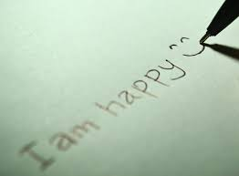

# Applied Data Science @ Columbia
## Fall 2023
## Project 1: What made you happy today?



### [Project Description](doc/Proj1_desc.md)
This is the first and only *individual* (as opposed to *team*) this semester. 

Term: Fall 2023

+ Projec title: What words lead to happiness?
+ This project is conducted by Clarence Jiang

+ Project summary: happy moments are great memory. This project will conduct data analysis on a dataset of happy moments, through classic visualization techinques and some NLP techniques to explore the relationship between words and happiness.

Following [suggestions](http://nicercode.github.io/blog/2013-04-05-projects/) by [RICH FITZJOHN](http://nicercode.github.io/about/#Team) (@richfitz). This folder is orgarnized as follows.

```
proj/
├── lib/
├── data/
├── doc/
├── figs/
└── output/
```

Please see each subfolder for a README file.
